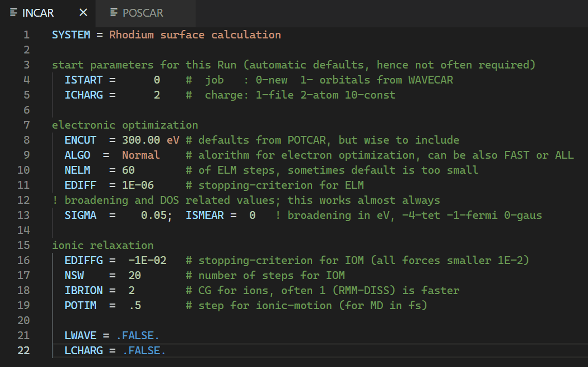

# VASP Support

Provides support for files of [VASP](https://www.vasp.at/). Currently, only [INCAR](https://www.vasp.at/wiki/index.php/INCAR) and [POSCAR](https://www.vasp.at/wiki/index.php/POSCAR)/[CONTCAR](https://www.vasp.at/wiki/index.php/CONTCAR) files are supported.

## Features

* INCAR
    * Syntax highlighting
    * Hover provider with live information from the [VASP Wiki](https://www.vasp.at/wiki/index.php/The_VASP_Manual)
        
* POSCAR/CONTCAR
    * Semantic highlighting
        
    * Linting (can be toggled in settings)
        
    * Code lenses to describe the different POSCAR sections (can be toggled in settings)
        